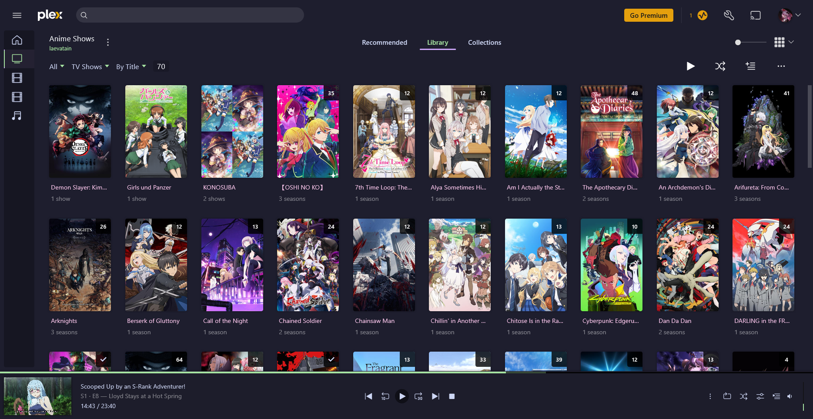

# Plex — Catppuccin Mocha

A **Catppuccin Mocha** theme for Plex Web.

This theme uses the [Theme-Park Plex base theme](https://theme-park.dev/css/base/plex/plex-base.css) as its foundation, with additional CSS overrides to better integrate the **Catppuccin Mocha** palette throughout Plex.

## 🎨 Preview



## ✨ Features

* 🌙 Catppuccin Mocha color palette
* 💜 Mauve primary accent
* 💚 Green playback and progress indicators
* ✨ Improved card hover and selection effects
* 🎯 Catppuccin-styled active and selected states
* 🔘 Customized buttons, badges, and selection controls
* 💬 Catppuccin-styled tooltips
* 📊 Green progress bars and loading indicators
* 🪟 Dark translucent navigation and bottom bars
* 🎨 Customized dropdowns and menus
* 🖥️ Improved header and sidebar styling

## 📦 Installation

This theme is intended to be used with **Stylus**.

### 1. Install Stylus

Install the Stylus browser extension for your browser:

* [Stylus for Firefox](https://addons.mozilla.org/firefox/addon/styl-us/)
* [Stylus for Chrome](https://chromewebstore.google.com/detail/stylus/clngdbkpkpeebahjckkjfobafhncgmne)

### 2. Create a new style

Open Plex Web and click the **Stylus** extension icon.

Create a new style and add the CSS import:

```text
@import url("https://raw.githubusercontent.com/vorlie/various-themes/refs/heads/main/plex/catppuccin.css");
```

### 3. Apply it to Plex

Set the style to apply to your Plex Web domain, then save it and reload Plex.

## 🎨 Color Palette

The theme primarily uses the Catppuccin Mocha palette:

| Color     | Hex       | Usage                         |
| --------- | --------- | ----------------------------- |
| Base      | `#1e1e2e` | Main background               |
| Mantle    | `#181825` | Modals and secondary surfaces |
| Surface 0 | `#313244` | Cards and dropdowns           |
| Mauve     | `#cba6f7` | Primary accent                |
| Pink      | `#f5c2e7` | Hover states                  |
| Green     | `#a6e3a1` | Playback and progress         |
| Text      | `#cdd6f4` | Primary text                  |
| Subtext   | `#9399b2` | Muted text                    |

## 🧩 Base Theme

This theme is built on top of the **Plex base theme from Theme-Park**:

https://theme-park.dev/css/base/plex/plex-base.css

The base stylesheet provides the majority of the underlying Plex customization.

This repository contains my additional overrides for areas that needed further adjustment to fit the Catppuccin Mocha palette.

## 🛠️ Custom Overrides

The custom CSS modifies several parts of Plex that don't fully follow the desired palette from the base theme.

### UI

* Modal borders and separators
* Settings and dashboard section borders
* Cards and wells
* Navigation and bottom bars
* Dropdown menus
* Headers
* Sidebar selection states

### Interaction

* Card hover effects
* Card selection effects
* Active icons
* Selected menu items
* Tab indicators
* Disclosure arrows
* Selection circles
* Button hover states

### Playback

* Play buttons
* Seek bars
* Volume sliders
* Playback progress
* Circular progress indicators
* Loading spinners

### Other

* Tooltips
* Badges
* Primary buttons
* Text colors
* Links
* Background colors

## ⚠️ Compatibility

Plex's web interface changes over time, and some of its CSS class names are generated or implementation-specific.

For example, this theme uses selectors such as:

```css
[class*=MetadataPosterCardFace-]
```

Because of this, Plex updates may cause individual parts of the theme to stop working or require updated selectors.

If something looks broken after a Plex update, the selectors in the custom CSS may need to be adjusted.

## 📜 Credits

### Theme-Park

The base Plex theme is provided by **Theme-Park**.

https://theme-park.dev/

### Catppuccin

The color palette is based on **Catppuccin Mocha**.

https://catppuccin.com/

## 📄 License

The custom CSS in this directory is provided as-is for personal use and customization.

Please retain the attribution to Theme-Park and Catppuccin when redistributing modified versions.

---

Made with 💜 for Plex.
